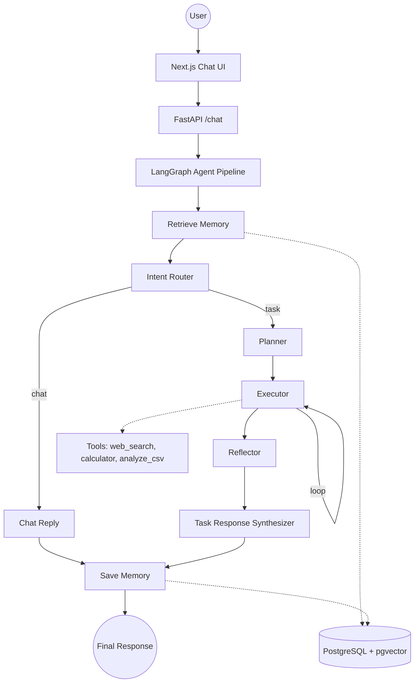

# AI Agent System

A multi-agent AI assistant built with **FastAPI**, **LangGraph**, **PostgreSQL + pgvector**, **Groq**, and **Mistral AI**. The system understands natural language requests, decides whether they need simple conversation or multi-step planning, executes tasks using real tools (web search, calculations, file analysis), reflects on its own output, and remembers relevant context across conversations.

## Live Demo

A Next.js chat interface lets you talk to the agent directly in the browser.

---

## Architecture



### How a message flows through the system

1. **Retrieve Memory** — the user's message is embedded (Mistral `mistral-embed`) and used to search for relevant past memories in PostgreSQL via `pgvector` cosine similarity. Only sufficiently relevant matches are returned.
2. **Intent Router** — a fast LLM call classifies the message as either:
   - **`chat`**: greetings, casual conversation → direct conversational reply
   - **`task`**: anything requiring planning, research, or multiple steps
3. **Chat path**: the **Chat Reply** node generates a natural response, optionally weaving in relevant memory — without claiming to "remember" things it doesn't actually have context for.
4. **Task path**:
   - **Planner** breaks the request into a short, ordered list of steps
   - **Executor** processes each step. The LLM can call tools (`web_search`, `calculator`, `analyze_csv`) when a step needs real-world information, then produces concrete output for that step
   - **Reflector** reviews all step outputs and critiques completeness/quality
   - **Task Response** synthesizes everything into a single, cohesive, user-facing answer
5. **Save Memory** — substantive messages (above a length threshold) are embedded and stored for future retrieval.

---

## Tech Stack

| Layer | Technology |
|---|---|
| Backend API | FastAPI |
| ORM / Models | SQLModel + SQLAlchemy (async) |
| Database | PostgreSQL 18 + `pgvector` |
| Agent Orchestration | LangGraph |
| LLM (primary) | Groq — `llama-3.1-8b-instant` |
| LLM (reflection/synthesis) | Mistral AI — `mistral-large-latest` |
| Embeddings | Mistral AI — `mistral-embed` (1024-dim) |
| Tools | DuckDuckGo web search, calculator, CSV analysis (pandas) |
| Frontend | Next.js (App Router) + TypeScript + Tailwind CSS |
| Markdown rendering | `react-markdown` |
| Containerization | Docker Compose |

---

## Getting Started

### Prerequisites

- Docker Desktop with WSL2 integration (Windows) or native Docker (Linux/Mac)
- Node.js + npm (for the frontend)
- A [Groq API key](https://console.groq.com)
- A [Mistral AI API key](https://console.mistral.ai)

### 1. Clone the repository

```bash
git clone https://github.com/eyamkaouar/ai-agent.git
cd ai-agent
```

### 2. Configure environment variables

Create a `.env` file in the project root:

```env
# Database
POSTGRES_USER=postgres
POSTGRES_PASSWORD=postgres
POSTGRES_DB=ai_agent_db
DATABASE_URL=postgresql+asyncpg://postgres:postgres@db:5432/ai_agent_db

# Redis
REDIS_URL=redis://redis:6379/0

# Auth
SECRET_KEY=your-secret-key-change-this-in-production
ALGORITHM=HS256
ACCESS_TOKEN_EXPIRE_MINUTES=30

# LLMs
GROQ_API_KEY=your-groq-api-key
MISTRAL_API_KEY=your-mistral-api-key
```

### 3. Start the backend

```bash
docker-compose up --build
```

This starts:
- PostgreSQL (with `pgvector` extension and full schema)
- Redis
- FastAPI backend at `http://localhost:8000`

Verify it's running:
```bash
curl http://localhost:8000/health
```

### 4. Start the frontend

```bash
cd frontend
npm install
npm run dev
```

Open **http://localhost:3000** in your browser.

---

## API Endpoints

| Endpoint | Method | Description |
|---|---|---|
| `/health` | GET | Health check |
| `/chat` | POST | Send a message, get the agent's response |
| `/auth/*` | — | User registration/login (scaffolded) |
| `/tasks/*` | — | Background task management (scaffolded) |
| `/memory/*` | — | Direct memory search (scaffolded) |
| `/upload/*` | — | File upload for analysis (scaffolded) |

### Example: `/chat`

```bash
curl -X POST http://localhost:8000/chat \
  -H "Content-Type: application/json" \
  -d '{"message": "Give me machine learning courses", "user_id": "<uuid>"}'
```

Response:
```json
{
  "response": "...synthesized markdown answer...",
  "intent": "task",
  "plan": ["..."],
  "reflection": "...",
  "tool_results": [...]
}
```

> Note: `user_id` must be a valid UUID that exists in the `users` table (foreign key constraint on `memories.user_id`).

---

## Known Limitations

- **LLM hallucination on sparse search results**: when `web_search` returns limited results, the model can occasionally blend in plausible-but-incorrect details (e.g., inventing course codes or URLs). Mitigated by prompting the model to only state facts grounded in tool results, but not fully eliminated with smaller models.
- **Rate limits on free-tier LLM APIs**: Groq's free tier has token-per-minute and token-per-day limits. The system uses retry-with-backoff (`with_retry`) to smooth over transient `429` errors.
- **No real authentication yet**: `/auth` endpoints are scaffolded but not wired into `/chat`; `user_id` is currently passed directly by the client.
- **Tasks endpoint, memory search endpoint, and file upload are not yet implemented.**

---

## Future Improvements

- Implement `/auth` (signup/login) and tie `user_id` to authenticated sessions
- Implement `/upload` with PDF/CSV/DOCX analysis tools
- Add Redis-backed short-term conversation memory
- Stream agent progress to the frontend (per-node status updates)
- Add citation tracking so synthesized answers can reference which tool result supports each claim
- Human-in-the-loop approval step for sensitive actions (e.g., sending emails)

